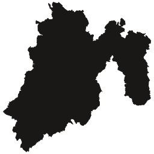

# Mexico states in SVG format!

This is a collection of all the states of Mexico in SVG format.

These were drawn using the maps found on the INEGI website: https://www.cuentame.inegi.org.mx/mapas/  
SVGs were minified using: https://compress-online.com/compress-svg

## Ciudad de Mexico (cdmx)

    
    

## Aguascalientes (ags)

    
    

## Baja California (bc)

    
    

## Baja California Sur (bcs)

    
    

## Campeche (camp)

    
    

## Coahuila de Zaragoza (coah)

    
    

## Colima (col)

    
    

## Chiapas (chis)

    
    

## Chihuahua (chih)

    
    

## Durango (dgo)

    
    

## Guanajuato (gto)

    
    

## Guerrero (gro)

    
    

## Hidalgo (hgo)

    
    

## Jalisco (jal)

    
    

## Mexico (edomex)

    
    

## Michoacan de Ocampo (mich)

    
    

## Morelos (mor)

    
    

## Nayarit (nay)

    
    

## Nuevo Leon (nl)

    
    

## Oaxaca (oax)

    
    

## Puebla (pue)

    
    

## Queretaro (qro)

    
    

## Quintana Roo (qroo)

    
    

## San Luis Potosi (slp)

    
    

## Sinaloa (sin)

    
    

## Sonora (son)

    
    

## Tabasco (tab)

    
    

## Tamaulipas (tamps)

    
    

## Tlaxcala (tlax)

    
    

## Veracruz de Ignacio de la (ver) Llave

    
    

## Yucatan (yuc)

    
    

## Zacatecas (zac)

    
    

